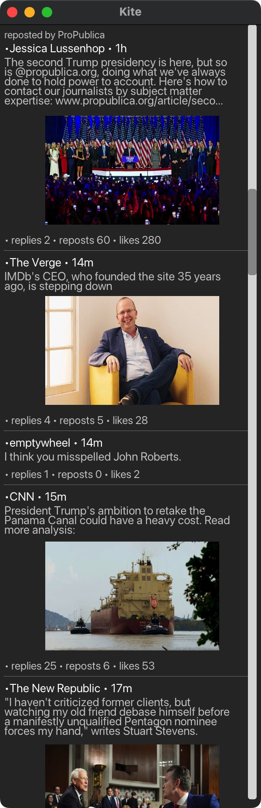

# Kite

A Bluesky desktop client written in the V programming language.
Currently in development so consider this a proof-of-concept for now.



## Features
- Updates timeline every minute

## Installing
Install the V compiler from https://vlang.io

```
git clone https://github.com/mike-ward/Kite
cd kite/src
v install ui
v run .
```

Kite relies on V's VUI library which is still in development.
Text rendering in particular is limited at this time.
Please do not report bugs with text rendering as they are known issues.